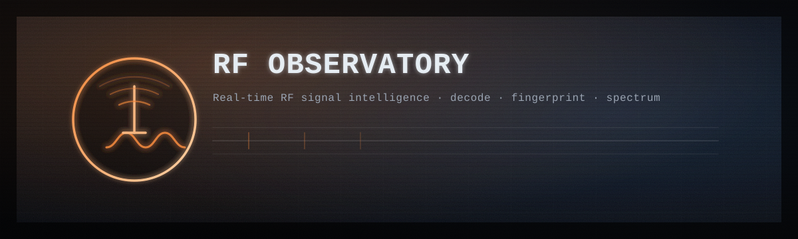

# RF Observatory

Real-time RF signal intelligence using Flipper Zero's Sub-GHz radio.

Stream, fingerprint, and decode wireless signals on 315/433/868/915 MHz bands.

## Features

- **Real-time streaming** - WebSocket-based live signal feed
- **Signal fingerprinting** - MD5 hash of quantized pulse patterns for tracking unique devices
- **Protocol classification** - Timing-based identification of common protocols:
  - Car remotes (Princeton, fixed code)
  - Gate remotes (CAME, Nice FLO)
  - Rolling code (KeeLoq)
  - Weather sensors (Oregon Scientific)
  - Smart meters
  - TPMS (tire pressure)
  - And more...
- **Band health metrics** - Entropy, burst rate, unique signals per minute
- **Web dashboard** - Dark-themed real-time visualization with waterfall, signal inspector, and event stream

## Requirements

- Flipper Zero with Sub-GHz radio
- Python 3.11+
- macOS/Linux (tested on macOS)

## Quick Start

```bash
# Install dependencies
make deps

# Start with Flipper (auto-detect port)
make start

# Or run without Flipper (mock mode for UI dev)
make mock
```

Open http://localhost:8765/

## Configuration

All configuration is via CLI flags:

```bash
# Focus on a single band
make start FREQS=433.92

# Custom ports
make start HTTP_PORT=8875 WS_PORT=8876

# Faster capture cycles
make start CAPTURE_DURATION=0.4

# Specific serial port
make start PORT=/dev/ttyACM0
```

Or run directly:
```bash
python3 rf_app.py --port auto --freqs 433.92 --capture-duration 0.4
```

## Flipper Tool

Python wrapper for direct Flipper CLI access:

```python
from flipper_tool import FlipperTool

with FlipperTool('/dev/cu.usbmodemflip_XXX') as f:
    info = f.device_info()
    print(info)

    # Raw capture
    timings = f.subghz_rx_raw(433920000, duration=2.0)
```

## Architecture

```
                              RF Observatory
                              Single URL: http://localhost:8765/

+-------------+    Serial     +-------------+
| Flipper Zero|<------------>| rf_app.py   |
| (Sub-GHz RX)|   230400 baud | - capture   |
+-------------+               | - classify  |
                              | - websocket |
                              +------+------+
                                     | JSON
                              +------v------+
                              | Browser     |
                              | Dashboard   |
                              +-------------+
```

## Protocol Classification

Signals are classified based on timing analysis:

| Protocol | Pulse Width | Min Pulses | Typical Use |
|----------|-------------|------------|-------------|
| Princeton | 200-500us | 20 | Car remotes, garage doors |
| CAME | 250-400us | 12 | European gates |
| Nice FLO | 600-900us | 12 | European gates |
| KeeLoq | 300-500us | 60 | Secure rolling code |
| Oregon v2 | 400-700us | 100 | Weather stations |
| Smart Meter | 15-50us | 100 | Utility meters |
| TPMS | 40-80us | 50 | Tire pressure |

## Legal

This tool is for **educational and authorized testing only**. Receiving RF signals is generally legal; transmitting or replaying signals without authorization is not. Know your local laws.

## License

MIT
